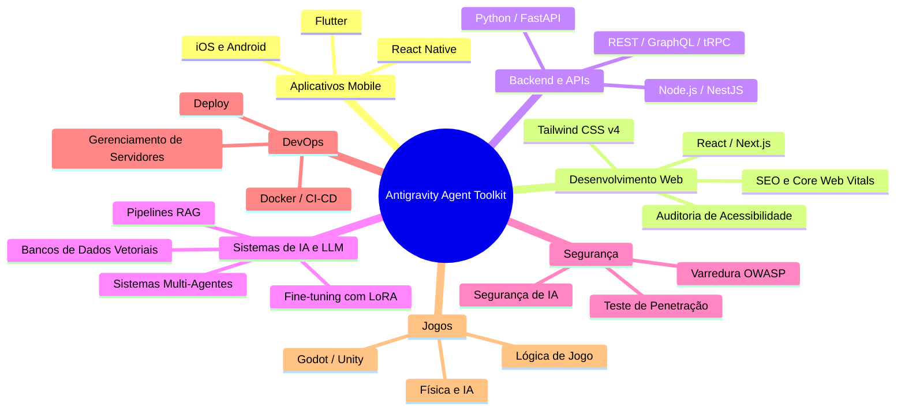

# 🚀 Antigravity Agent Toolkit

**Kit de Ferramentas para Desenvolvimento Assistido com Agentes de IA**. Transforme qualquer assistente de código IA em um especialista de domínio com **21 agentes**, **53 habilidades** e **15 workflows**.

## 🎯 Quais os Domínios Aplicáveis?

O Antigravity Agent Toolkit cobre o ciclo completo de desenvolvimento de software em **7 domínios de aplicação**:



> **Próxima feature:** suporte a **RPA (Robotic Process Automation)** com Engenharia de Contexto — novos agentes, skills e workflows para automação inteligente de processos.


## 🗺️ Tecnologias Abordadas

| Categoria | Tecnologias |
| :--- | :--- |
| **Linguagens** | TypeScript, JavaScript, Python, Rust, Bash, PowerShell |
| **Frameworks Web** | React, Next.js, Nuxt, NestJS, FastAPI, Tailwind, Vite |
| **Frameworks IA** | LangChain, LangGraph, LlamaIndex, DSPy, Unsloth |
| **Provedores LLM** | OpenAI, Gemini, Claude, Groq, Mistral, Cohere, Ollama |
| **Bancos Vetoriais** | pgvector, Qdrant, Pinecone, Weaviate, Chroma, Milvus |
| **Bancos de Dados** | PostgreSQL, MongoDB, Redis, Supabase, Firebase |
| **Testes** | Playwright, Jest, Vitest |

## ⚡ Instalação Rápida

```bash
# Instalar no projeto atual
npx antigravity-agent-toolkit init

# Instalar globalmente
npx antigravity-agent-toolkit init --global
```
## 🛠️ Comandos

```bash
# Instalar no projeto atual
npx antigravity-agent-toolkit init

# Instalar globalmente (~/.gemini/antigravity/)
npx antigravity-agent-toolkit init --global

# Atualizar instalação existente (com backup automático)
npx antigravity-agent-toolkit update

# Listar componentes disponíveis
npx antigravity-agent-toolkit list
npx antigravity-agent-toolkit list agents
npx antigravity-agent-toolkit list skills

# Simular sem criar arquivos
npx antigravity-agent-toolkit init --dry-run

# Sobrescrever sem perguntar
npx antigravity-agent-toolkit init --force
```

## 📦 O que é instalado

O toolkit cria um diretório `.agent/` contendo:

| Componente | Quantidade | Descrição |
| :--- | :---: | :--- |
| **Agentes** | 21 | Personas IA especialistas |
| **Habilidades** | 53 | Módulos de conhecimento sob demanda |
| **Workflows** | 15 | Procedimentos passo a passo |
| **Scripts** | 13 | Ferramentas executáveis |

## 🧑‍💻 Como usar

Após instalar, basta conversar normalmente com seu assistente de código. O **Roteador Inteligente** seleciona automaticamente o melhor agente para cada solicitação.

### Roteamento Automático

Peça qualquer coisa — o toolkit identifica o domínio e aplica o especialista certo:

```
Você: "Crie um componente de login com validação"
🤖 Aplicando conhecimento de @frontend-specialist...
```

```
Você: "Analise as vulnerabilidades deste endpoint"
🤖 Aplicando conhecimento de @security-auditor...
```

### Comandos Slash

Use workflows pré-definidos para tarefas comuns:

| Comando | O que faz |
| :--- | :--- |
| `/plan` | Cria plano de projeto em 4 fases |
| `/create` | Inicia criação de aplicação do zero |
| `/debug` | Ativa modo de debugging sistemático |
| `/test` | Gera e executa testes |
| `/deploy` | Checklist de pré-deploy e execução |
| `/orchestrate` | Coordena múltiplos agentes em uma tarefa |
| `/brainstorm` | Sessão de brainstorming estruturado |

### Menção Direta

Para forçar um agente específico, mencione-o com `@`:

```
@backend-specialist Crie uma API REST para gerenciar produtos
@mobile-developer Implemente navegação com tabs no React Native
@ai-architect Monte um pipeline RAG com pgvector
```

## 📖 Documentação

Após a instalação, abra `.agent/ARCHITECTURE.md` para a documentação completa da arquitetura.

## 📄 Licença

MIT © [Daniel-da-Silva-Alves](https://github.com/Daniel-da-Silva-Alves)
